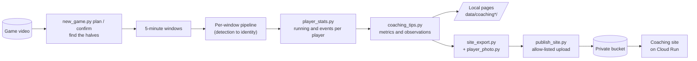
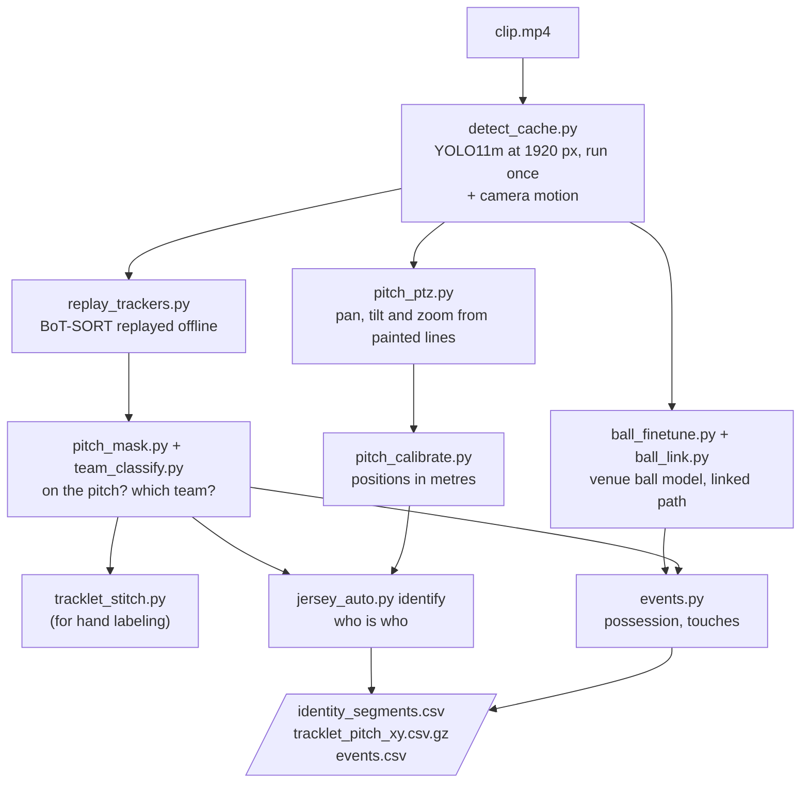
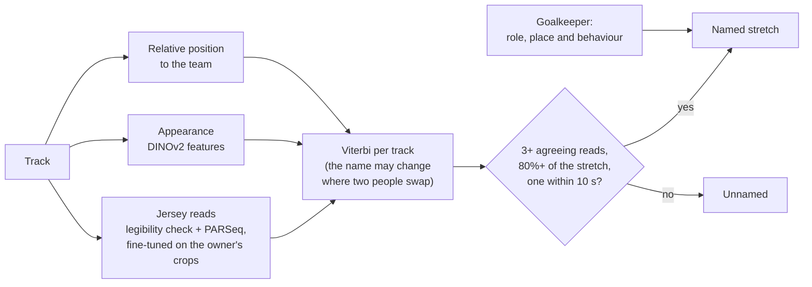
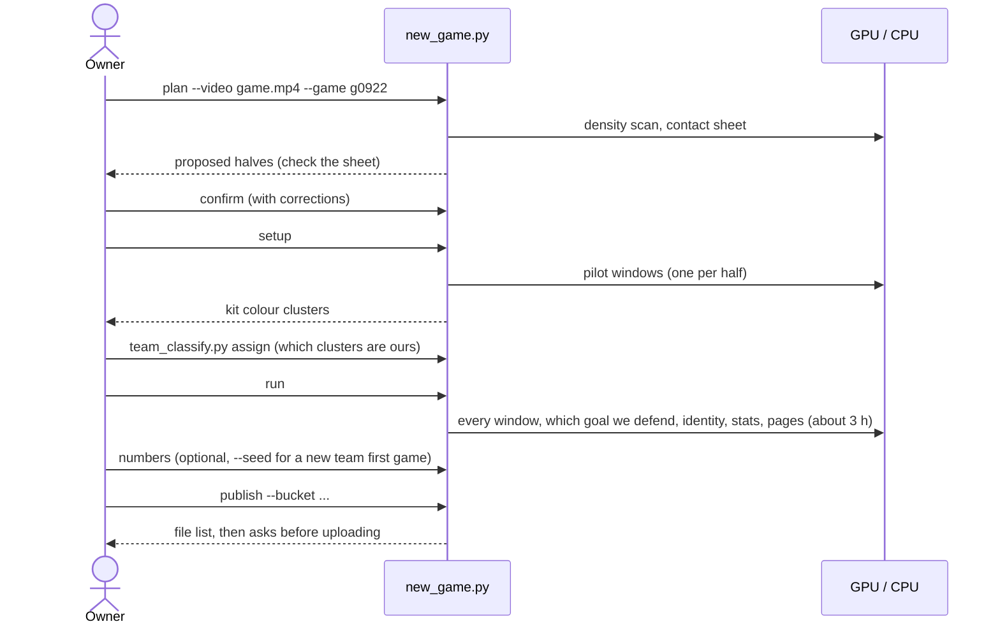
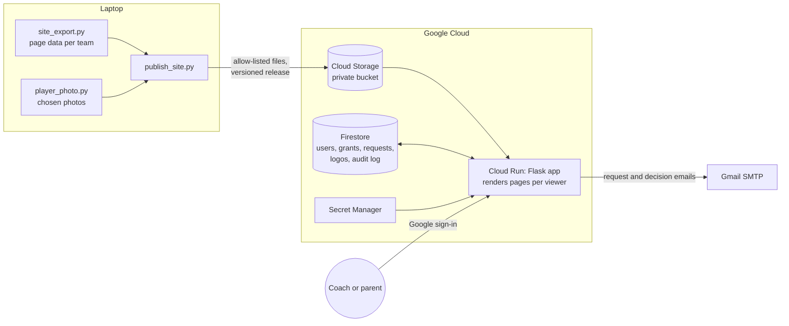

# Soccer video analysis

Per-player running stats, positions, touches and coaching observations from sideline video of youth soccer games,
filmed with an auto-panning camera. Results appear as local pages, and on a private website for the team's
families and coaches.

**Status:** a personal project, in use on real games (several JV games and a Varsity game so far). A new game needs
a few minutes of the owner's time (confirming the halves and which kit colours are ours) plus about 3 hours of
unattended compute. Every number is an automatic estimate with a stated confidence (see
[Results and limits](#results-and-limits)).

> **Privacy first.** The footage shows minors. No video, crops, rosters, names, jersey numbers, or team or school
> names are in this repository, and every stage refuses to write outside the git-ignored `data/` folder. Per-player
> pages leave the computer only through one allow-listed upload to a private bucket, behind Google sign-in.

## Contents

- [What it produces](#what-it-produces)
- [Quick start](#quick-start)
- [How it works](#how-it-works)
- [Usage](#usage)
- [Project layout](#project-layout)
- [Results and limits](#results-and-limits)
- [Development](#development)
- [Credits and licences](#credits-and-licences)

## What it produces

For each identified player, per game and across the season:

- **Running:** distance per minute, time at speed, and work rate compared with teammates in the same minutes, with
  the window-to-window spread shown as error bars.
- **Position:** a heatmap of where they play, and their depth relative to the team line, width and range.
- **Involvement:** time near the ball, and touches per minute compared with teammates.
- **Observations:** plain-language coaching notes that pass a noise test (for example "covers more ground than
  teammates in the same minutes"), tagged by whether they hold in every game or only in one.
- **Where to see them:** local HTML pages, and a website. On the site, coaches see the whole team, and parents see
  team numbers with only their own child named. Each player has a grade (Freshman to Senior) and a photo.

## Quick start

Requirements: Windows, Python 3.12+, an NVIDIA GPU (developed on an RTX 3060 Laptop with 6 GB), and FFmpeg.

```powershell
python -m venv .venv
.venv\Scripts\Activate.ps1
# PyTorch with CUDA first, from https://pytorch.org for your CUDA version
pip install -r requirements.txt
winget install Gyan.FFmpeg          # then open a new terminal
python -c "import torch; print(torch.cuda.is_available())"   # must print True
```

Model weights aren't in the repository (`models/` is git-ignored). The YOLO weights download on first use. The
jersey reader and the ball model are fine-tuned locally on the owner's labels (see [Usage](#usage)).

To process one 5-minute window of a game:

```powershell
python run_all.py --video videos\<game>.mp4 --start 00:14:00 --duration 300 --out data\clipA
```

Detection runs at about 13 frames per second, so a 5-minute window takes about 12 minutes. For a whole game, use
`new_game.py` (see [A new game, end to end](#a-new-game-end-to-end)).

## How it works

### The big picture

A game video is split into 5-minute windows. Each window goes through the same stages, and every stage writes its
output to disk, so any stage can be rerun and checked on its own. The windows then feed per-player stats, coaching
pages and the website.



### Per-window pipeline



The main design choices:

- **Detect once, track many times.** Detections are cached, so trackers can be replayed and compared offline. The
  tracker settings were chosen with blind hand labels of whether a track stays on one person, not with a proxy
  score, because a lenient tracker scores well on proxies while swapping people.
- **The camera stands still; only pan, tilt and zoom change.** One camera model is fitted to the painted lines,
  then each frame is solved for pan, tilt and zoom. Positions land within about 0.2 to 0.4 m of hand-placed
  anchors, with no anchors needed for a new game.
- **The ball has its own detector,** fine-tuned on hand-labeled frames from this venue. Detections are linked over
  time with clutter filters, since spare balls and sideline markers look like balls.
- **Teams are separate.** Each game belongs to a team (such as JV or Varsity), and each team has its own roster.
  Identity only uses labels from the same team.

### Identity: who is who

Jersey numbers are about 10 to 20 pixels tall, so ordinary OCR can't read them. Instead, identity combines weak
evidence along each track, and names a stretch of a track only when enough reads agree:



Only reads decide whether a name is trusted. A confidence based on appearance was tested and turned out to be
overconfident, so appearance only moves where a stretch starts and ends. This names 35 to 55% of a team's tracked
time, and on held-out, hand-labeled windows 91 to 99.8% of the names are right.

A new team starts with no labels: its first game uses reads alone, after a short owner round confirming crops of
each roster number (`new_game.py numbers --seed`, about 15 to 20 minutes).

### A new game, end to end

The owner's steps are the ones only a person can do: checking where play starts and ends, which kit colours are
ours, and occasionally confirming a few jersey crops.



### The coaching site



- **Access is per team.** Coaches see every player of their team. Parents see team totals with only their own
  players named and pictured. Admins manage people and approve access requests. Anyone can ask for access, and the
  admins get an email.
- **Pages are rendered per request,** with the same builders as the local pages, so a parent's browser never
  receives another child's name or photo.
- **Security:** CSRF tokens, a nonce-based content security policy, `noindex` and `no-store` headers, images served
  only after a permission check, and an audit log of every admin change.

For setup and deployment, see [webapp/README.md](webapp/README.md).

## Usage

| Task | Command |
|---|---|
| A new game | `new_game.py plan`, `confirm`, `setup`, `run`, then `publish` ([docs/tools.md](docs/tools.md#a-new-game)) |
| One window by hand | `run_all.py`, then the stage scripts (each has `--help`) |
| Coaching pages (local) | `coaching_tips.py --runs <windows of one team>` |
| Publish to the site | `new_game.py publish --bucket <bucket>` |
| Retrain the jersey reader | `jersey_rare_label.py candidates` and `label`, then `jersey_auto.py finetune` |
| Retrain the ball model | `ball_label.py label`, then `ball_finetune.py dataset`, `train` and `apply` |
| Check a stage by hand | The labeling tools for roles, ball, events, jerseys and track purity ([docs/tools.md](docs/tools.md)) |

Every script has `--help`. Local, per-game settings live in git-ignored files:

- `data/<game>/game.local.json`: the halves, which goal we defend, and the team.
- `pitch_camera.local.json` and `kit_prototypes.local.json`.
- One roster per team.

## Project layout

```
*.py          pipeline stages and tools, one script per stage (sv_common.py is shared)
webapp/       the coaching site (Flask on Cloud Run) and its deployment guide
tests/        site tests (synthetic players only)
trackers/     tracker configurations
docs/         tool guides
CLAUDE.md     detailed project log: every experiment, measurement and decision
data/         git-ignored: windows, caches, labels and outputs (footage of minors)
models/       git-ignored: fine-tuned weights
roster.csv    git-ignored: the first team's roster (other teams' are in data/teams/<team>/)
```

## Results and limits

Measured against the owner's hand labels, on windows the models didn't train on:

| What | Result |
|---|---|
| Tracking | about 9% of tracked time is on the wrong person, mostly when players cross |
| Pitch position | median error 0.2 to 0.4 m at hand-placed anchors, with no anchors needed per game |
| Ball path (venue model) | on the ball in 68 to 70% of visible frames; the misses are mostly a ball hidden at a player's feet |
| Identity | 35 to 55% of a team's tracked time named, and 91 to 99.8% of names right |
| Possession events | F1 about 0.6; passes are not reliable |
| Running distance | **not yet checked** against a measured run; noise floor 17 to 29 m/min, depending on the window |

Things that were tested and didn't work (details in [CLAUDE.md](CLAUDE.md)):

- **Generic person re-identification** separates teams, not teammates, so it was dropped from tracking and from
  linking.
- **Linking identity across tracks** by motion and appearance wasn't reliable enough to adopt, even with player
  height added.
- **Ball recall** is limited by the ball being hidden. Magnified tiles and carrying the ball with the player didn't
  help.
- **A learned possession model** tied the hand-set rules: the inputs limit the events, not the rules.

To compare players, use the ratios to teammates, within a game and across games. Absolute numbers vary between
windows with each window's measurement noise.

## Development

```powershell
pip install -r requirements-dev.txt
pytest -q tests                  # the site: roles, access, requests, headers (synthetic data)
ruff check . ; ruff format --check .
```

CI runs ruff, the tests and an automated review on every pull request, and each change gets its own pull request.
The ground rules for contributors, including the AI assistant that writes most of the code, are at the top of
[CLAUDE.md](CLAUDE.md): nothing identifying in commits, a confidence on every stat, and every stage rerunnable.

## Credits and licences

This repository has no licence file yet, so all rights are reserved by default. It builds on:

- [Ultralytics YOLO](https://github.com/ultralytics/ultralytics) (AGPL-3.0): detection, and the BoT-SORT and
  ByteTrack tracker implementations.
- [jersey-number-pipeline](https://github.com/mkoshkina/jersey-number-pipeline) (Koshkina and Elder, 2024;
  non-commercial licence): the SoccerNet-trained legibility classifier and jersey reader weights.
- [PARSeq](https://github.com/baudm/parseq) (Apache-2.0): the text recognizer behind the jersey reader.
- [DINOv2](https://github.com/facebookresearch/dinov2) (Apache-2.0): appearance features.

The non-commercial and AGPL terms of these dependencies apply to any use of this code.
